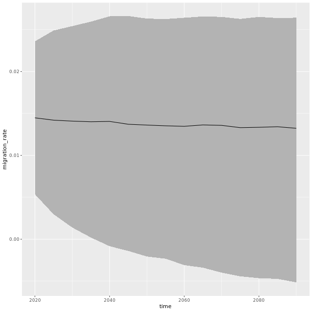

# Chapter 1

- Lecturer: Hana Sevcikova
- Title: Senior Research Scientist at UW

# Courses:

## Partitioning problems into dependent pieces 1 out of 4

**Prerequisites**

- Writing Efficient R
- Optimized sequential code
- Benchmark your code

**Objective**

- Ready to break your code into multiple pieces that can run in parrallele, load-balanced and in reproducible manner.

### Overview:

1. Methods of parrallele proramming & supporting R packages
2. The parallel core package in detail
3. Packages foreach and future.apply
4. Random numbers & reproducibility and final example

- **Why we need parrallel? Why we need Partitioning? and How to split them??**
- Let me show you example for How:

1. By Tasks
2. By Data

**By Tasks**:
For building a house, there are many tasks can do independently, and in parrallel: such as roofing, installing window, plumbing, flooring, etc.

**By Data**:
For building a house, all windows can be installed in parrallel. SAME TASK, apply on different data in parrallel.

#### Summary of partitioning

1. By Task: Apply different tasks to the same or different data.
2. By Data: The same task is performed on different data.

- Embarrassinly parallel applications - means so easy to make it in parrallel

## Models of parallel computing 2 out of 4

# Practices:

### Practice 1 out of 4:

Yuanfeng Li
10282021

#### Partitioning demographic model

**Question1**
Consider a demographic projection model at time t: Population(t) = Population(t-1) + Births(t) - Deaths(t) + Net Migration(t), consisting of four submodels, namely for projecting births, deaths, migration and population at time t-1. How can this model be split into independent pieces that could run in parallel?

Possible Answers:

1. The model cannot be parallelized.
2. All four submodels can run in parallel.
3. Submodels Births, Deaths and Migration can run in parallel but not Population.

I have chosen 1, and is incorrect, the hint says: "No! Some submodels are independent of one another."

I have chosen 2, and is incorrect, the hint says: "No! Look for dependencies in the model equation."

I have chosen 2, and is incorrect, the hint says: "Yes! Projecting population depends on births, deaths and migration, therefore it cannot run independently of those submodels. You just partitioned a problem by TASK!"

**Question2**
Partitioning probabilistic demographic model
Now consider a probabilistic version of the previous model. In this case, each of the four submodels processes a set (not just one) of independent trajectories of their respective quantity. How can this model be parallelized?

A. Now the Population submodel can also run independently of the other three submodels.
B. Each submodel can process each trajectory in parallel to other trajectories.
C. Submodels Births, Deaths and Migration can run independently of one another but no parallelization within the submodels.
D. The Population submodel can be only parallelized by trajectories.

Answer possible:

1. A & B
2. B & D
3. C & D
4. A & C

Choose 2 is correct:
Yes! Trajectories are independent of one another, therefore they can be processed in parallel in all four submodels including Population. Congratulations, you just partitioned a problem by DATA! The same task (submodel) is applied to different data (trajectories).

Others are incorrect: 1  
No! The model equation did not change. Population still depends on births, deaths and migration.

3 4
No! Trajectories are independent of one another, therefore they can be processed in parallel within each submodel.

**Coding Practice 1**:
Find the most frequent words in a text
We will now turn to partitioning by data. Here is an example that will be used throughout the course: In the given text, find the most frequent words that start with each letter of the alphabet and are at least a given length long. You'll use the janeaustenr package with its 6 books by Jane Austen, which is available in your environment. Also loaded are the stringr package and the function janeausten_words(), which extracts words from the 6 books and converts them to lowercase. Here, the specific task is to find, for each letter of the alphabet, the most frequent word that is at least five characters long. Your job is to partition this task into independent pieces.

- instructions:

  1. The object words contains all words from the 6 books. Use the preloaded function max_frequency() to find the most frequent word of all words starting with an "a" (arg letter) that are 5 or more characters long (arg min_length).

  2. To partition the main task, let the lapply() function repeatedly call max_frequency() over all letters.
     To enumerate all letters of the alphabet, call lapply() on letters.
     The arguments words and min_length are the same as your first call of max_frequency().
     (My perspective is that letters is another vector defined earlier)

3. Plot a barplot of result.

```
# 1st instruction
# Vector of words from all six books
words <- janeausten_words()

# Most frequent "a"-word that is at least 5 chars long
max_frequency(letter = "a", words = words, min_length = 5)


# 2nd instruction
# Partitioning
result <- lapply(letters, max_frequency,
                 words = words, min_length = 5) %>% unlist()

## 3
# Barplot of result
barplot(result, las = 2)
```

see the barplot here


Excellent! You have partitioned the task into independent pieces using “lapply()” (an alternative is to use a “for” loop). The function “max_frequency()” is repeatedly applied to a different part of the data, namely one letter of the alphabet.

## Part 2 of 1 chapter 110221##

**review of last class**

- things I missed:
  1. Embarrassinly parallel applications - means so easy to make it in parrallel
  2.
  3. I have Learned how to break code into independent pieces

**New contents**:

1. at least two cores, CPUs,

- multiprocessor
- cluster of computers

2. Memory:

- shared memory

  - time efficient

- distributed memory
  - messaging passing software (can run on both)
  - independent of underlying hardware

3. Programming paradigms

- Master - worker model
- Map-reduce paradigm
  - applications for distributed data
  - Hadoop, Spark
  - scalable data process in R (Dc class)

4. this course focus on Master - worker model

- can solve last class' challenges, one core to be master and distribute tasks to other cores as workers, Master - worker model is extremely well suited for embaraasinly parrallel applications.

```
initialize.rng()
for (it in 1:N) result[it] <- myfunc(...)
process(result, ...)
```

**Practice**

1. A simple embarrassingly parallel application
   As a simple example of an embarrassingly parallel statistical application, we will repeatedly compute the mean of a set of normally distributed random numbers. For now, you will process it sequentially using a for loop, and the sapply() function.

In general, we recommend to implement any task that will be repeatedly applied to data as a function. Here, the function will be called mean_of_rnorm(). It generates random numbers with rnorm(), then computes their mean.

The objects n_numbers_per_replicate (set to 10000) and n_replicates (set to 50) have been created for you and determine the length of the random numbers vector and how many times the task is repeated, respectively.

1.1 instructions:
Complete the definition of a function, mean_of_rnorm, to calculate normally distributed random numbers.
The function should take one argument: n .
Draw random numbers by calling rnorm(), passing it the mean_of_rnorm argument n and assigning the result to random_numbers.
Calculate the mean of the random numbers.
Try the function by calling it, setting n to 100.

1.2 instru:
In this example, you'll call mean_of_rnorm() many times (sequentially) using a for loop.

To store the result, create a vector of the value NA, rep()eated n_replicates times.
For reproducibility, use set.seed() to set the random number generation seed to 123.
Define a for loop, with variable iter counting from 1 to n_replicates.
Inside the loop, set result[iter] to the result of mean_of_rnorm(), called with n_numbers_per_replicate.
Run the histogram code to see the results.

1.3:
In this example, you'll use the apply-like syntax.

Create a vector of n_numbers_per_replicate, repeated n_replicates times.
Call mean_of_rnorm() repeatedly using sapply().
Pass the vector of n.
The function to call is mean_of_rnorm (without parentheses).
Run the histogram code to see the results.

```
<!-- 1.1 code: -->
# Complete the function definition
mean_of_rnorm <- function(n) {
  # Generate normally distributed random numbers
  random_numbers <- rnorm(n)
  # Calculate the mean of the random numbers
  mean(random_numbers)
}

# Try it out
mean_of_rnorm(100)


## 1.2 code
# From previous step
mean_of_rnorm <- function(n) {
  random_numbers <- rnorm(n)
  mean(random_numbers)
}

# Create a vector to store the results
result <- c()

# Set the random seed to 123
set.seed(123)

# Set up a for loop with iter from 1 to n_replicates
for (iter in 1:n_replicates) {
  # Call mean_of_rnorm with n_numbers_per_replicate
  result[iter] <- mean_of_rnorm(n_numbers_per_replicate)
}

# View the result
hist(result)
```

- result in 1_2 barplot:
  
- result in 1_2_3 barplot:
  
- result in 1_2_3 barplot:
  

2. exercise:

- demographic project through the course
  Contents:
  Probabilistic projection of migration (setup)
  We'll now introduce a demographic model to be used throughout the course. It projects net migration rates via an autoregressive model (AR1). It is a typical example of an embarrassingly parallel application where a set of estimated parameters is used repeatedly for prediction. In an AR1, a future value is dependent on the past value. The process has a long term mean (mu), a rate of convergence (phi) to mu, and an error term with standard deviation (sigma). You do not need to know details of the modelling.

We have simulated 1000 samples of these three parameters (dataset ar1est) and will use it to project the future distribution of migration rates. Starting from an initial rate (rate0), each row of ar1est can be used to generate a block of migration trajectories (using function ar1_block_of_trajectories()). This process is shown in the image below (where ar1_block_of_trajectories() is abbreviated with ar1_block()). Combining blocks from all rows gives the final migration distribution.


Your job in this exercise is to explore the function ar1_block_of_trajectories() (type ar1_block_of_trajectories in your console). Its argument id determines which row of ar1est to use. What type of object does the function return and what do the function arguments traj_len and block_size correspond to in the function output?

- Possible Answers

1. Matrix where argument traj_len corresponds to rows and block_size corresponds to columns.

2. Matrix where traj_len corresponds to columns and block_size corresponds to rows.

3. List of vectors where traj_len corresponds to list length and block_size corresponds to each vector length.

Submit Answer

**Correct Answer**:

- the correct one is the 2nd!
  Bravo! traj_len is the length of migration trajectories (or the number of time points in the projection). Each trajectory is stored as a row and the number of rows is determined by the argument block_size. In the next exercise you will be able to visualize the trajectories

- Exercise 3:
  Probabilistic projection of migration
  Here, we'll continue the previous application. The 1000 sets of estimates in ar1est is a result of an estimation using migration data for the United States. The task is to project the future distribution of the US migration rate for 15 time points using the whole estimation dataset instead of just one row. You will generate a set of 10000 trajectories of length 15, each of which makes use of one parameter set, thus each parameter row is re-used 10 times. You will also visualize the results using a preloaded function show_migration().

  3.1 Instructions:

```
# The name of the rbind R function stands for row-bind. The rbind # #function can be used to combine several vectors, matrices and/or data #frames by rows.Apr 10, 2020
# From previous step

ar1_multiple_blocks_of_trajectories <- function(ids, ...) {
  trajectories_by_block <- lapply(ids, ar1_block_of_trajectories, ...)
  do.call(rbind, trajectories_by_block)
}

<!-- Define trajectory IDs as a sequence from 1 to the number of blocks. That is, the number of rows in ar1est. -->
# Create a sequence from 1 to number of blocks
traj_ids <- seq(1, nrow(ar1est))


<!-- Apply ar1_multiple_blocks_of_trajectories() to traj_ids with 0.015 as rate0, block size 10, and 15 time periods. -->
# Generate trajectories for all rows of the estimation dataset
trajs <- ar1_multiple_blocks_of_trajectories(
  ids = traj_ids, rate0 = 0.015,
  block_size = 10, traj_len = 15
)

<!-- Call show_migration() on trajs. -->
# Show results
show_migration(trajs)
```


